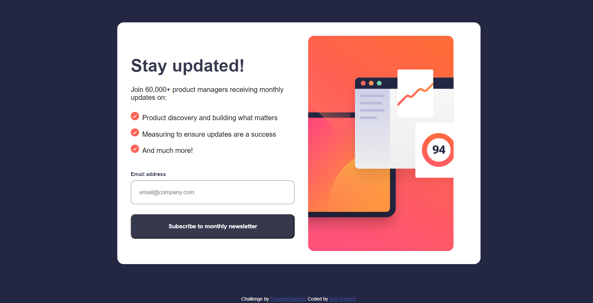
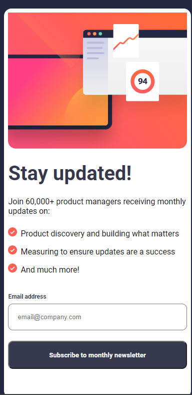
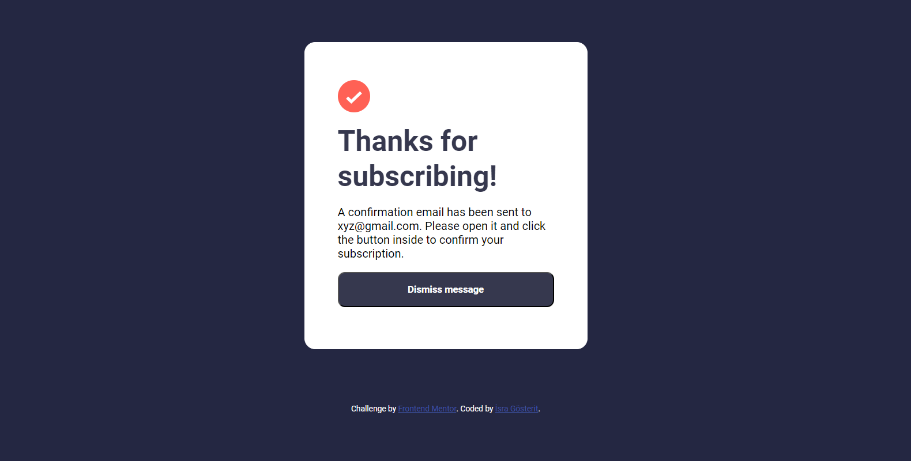

# Frontend Mentor - Newsletter sign-up form with success message solution

This is a solution to the [Newsletter sign-up form with success message challenge on Frontend Mentor](https://www.frontendmentor.io/challenges/newsletter-signup-form-with-success-message-3FC1AZbNrv). Frontend Mentor challenges help you improve your coding skills by building realistic projects. 

## Table of contents

- [Overview](#overview)
  - [The challenge](#the-challenge)
  - [Screenshot](#screenshot)
  - [Links](#links)
- [My process](#my-process)
  - [Built with](#built-with)
  - [What I learned](#what-i-learned)
  - [Continued development](#continued-development)
  - [Useful resources](#useful-resources)
- [Author](#author)
- [Acknowledgments](#acknowledgments)

**Note: Delete this note and update the table of contents based on what sections you keep.**

## Overview

### The challenge

Users should be able to:

- Add their email and submit the form
- See a success message with their email after successfully submitting the form
- See form validation messages if:
  - The field is left empty
  - The email address is not formatted correctly
- View the optimal layout for the interface depending on their device's screen size
- See hover and focus states for all interactive elements on the page

### Screenshot






### Links

- Solution URL: [Solution](https://www.frontendmentor.io/solutions/newsletter-signup-form-with-success-message-solution-p4EhVytgL2)
- Live Site URL: [Live](https://newsletter-sign-up-with-success-message-main-75umytw46.vercel.app/)

## My process

### Built with

- Semantic HTML5 markup
- CSS custom properties
- Flexbox
- Mobile-first workflow
- (https://cssgradient.io/) - For styles


### What I learned

I learned how to add an image as a background using the content property, as demonstrated in the following code snippet:

```css
.svg-picture {
  content: url(assets/images/illustration-sign-up-mobile.svg);
}
```

I've learned to use the @font-face rule to import 'Roboto' font in my project, with the purpose of utilizing different font weights.

```css
@font-face {
  font-family: 'Roboto';
  src: url('./assets/fonts/Roboto-Regular.ttf') format('truetype');
  font-weight: 400;
}

@font-face {
  font-family: 'Roboto';
  src: url('./assets/fonts/Roboto-Bold.ttf') format('truetype');
  font-weight: 700;
}
```

### Useful resources

- [CSS Gradient](https://cssgradient.io/) -  This tool was incredibly helpful for generating custom CSS gradients. 

## Author

- Frontend Mentor - [@isragosterit](https://www.frontendmentor.io/profile/isragosterit)
- Twitter - [@isragosterit](https://twitter.com/isragosterit)
